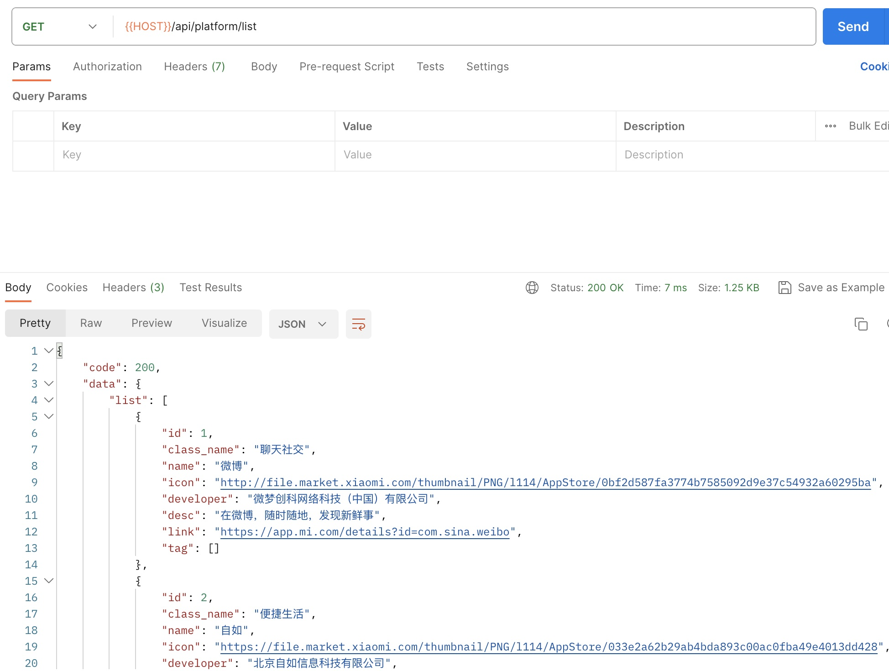

# 蜘蛛007-后端

## 项目介绍

蜘蛛007微信小程序，一键查询你的手机号码在哪些App和网站平台上注册过账号

后端服务基于微信云托管部署，好处是部署、开发和维护变得更加便捷，坏处是成本高，更多微信云托管介绍可参考[官方文档](https://developers.weixin.qq.com/miniprogram/dev/wxcloudrun/src/basic/intro.html)

## 部署步骤

### 数据库初始化

1. 新建数据库 `d_spider007`
2. 导入sql到数据库 `mysql -uroot -p d_spider007 < d_spider007.sql`

### 项目初始化

修改配置文件 `conf/config.yaml`

```yaml
Server:
  HttpPort: 80
  ReadTimeout: 60
  WriteTimeout: 60
Database:
  DBType: mysql
  User: root
  Password:
  Host: 127.0.0.1:3306
  DBName: d_spider007
```

### 运行测试

`go run main.go`

1. ping测试
   

2. 查看支持查询的平台清单
   

3. 一键查询接口
   

### 部署到微信云托管

将项目文件压缩打包，部署发布


## 接口说明

### 1. `/ping`

**请求方法**: GET

**功能**: 用于健康检查。

**响应**:

| 字段     | 类型 | 说明 |
| ------- | ---- | --- |
| message | string | 总是返回 "pong" |

### 2. `/api/class/add`

**请求方法**: POST

**功能**: 添加 `App` 类别。

**请求参数**:

| 字段 | 类型 | 说明 | 
| --- | ---- | --- | 
| name | string | 类别名称 |

**响应**:

| 字段 | 类型 | 说明 |
| --- | ---- | --- |
| code | int | 状态码 |
| msg | string | 状态消息 |
| data | struct | 已添加的类别数据或false |

### 3. `/api/class/list`

**请求方法**: GET

**功能**: 查询 `App` 类别清单。

**请求参数**:

| 字段 | 类型 | 说明 | 
| --- | ---- | --- | 
| offset | int | 偏移量 |
| page_size | int | 每页数量 |

**响应**:

| 字段 | 类型 | 说明 |
| --- | ---- | --- |
| code | int | 状态码 |
| msg | string | 状态消息 |
| data | struct | 包含一个类别项数组和总数 |

### 4. `/api/platform/add`

**请求方法**: POST

**功能**: 添加支持检查的平台。

**请求参数**:

| 字段 | 类型 | 说明 | 
| --- | ---- | --- | 
| class_id | int | 类别ID |
| name | string | 平台名称 |
| icon | string | 平台icon |
| developer | string | 平台开发者 |
| desc | string | 平台描述 |
| link | string | 平台链接 |
| tag | []string | 标签数组 |

**响应**:

| 字段 | 类型 | 说明 |
| --- | ---- | --- |
| code | int | 状态码 |
| msg | string | 状态消息 |
| data | struct | 已添加的平台数据或false |

### 5. `/api/platform/list`

**请求方法**: GET

**功能**: 查询支持检查的平台清单。

**请求参数**:

| 字段 | 类型 | 说明 | 
| --- | ---- | --- | 
| offset | int | 偏移量 |
| page_size | int | 每页数量 |

**响应**:

| 字段 | 类型 | 说明 |
| --- | ---- | --- |
| code | int | 状态码 |
| msg | string | 状态消息 |
| data | struct | 包含一个平台项数组和总数 |

### 6. `/api/register/scan`

**请求方法**: POST

**功能**: 一键扫描支持检查的平台清单。

**请求参数**:

| 字段 | 类型 | 说明 | 
| --- | ---- | --- | 
| phone_num | int | 手机号 |

**响应**:

| 字段 | 类型 | 说明 |
| --- | ---- | --- |
| code | int | 状态码 |
| msg | string | 状态消息 |
| data | struct | 注册的平台项数组和总数 |

### 7. `/api/user/check-user`

**请求方法**: GET

**功能**: 查询用户是否存在。

**请求头部**:

| 字段       | 类型   | 说明             |
| ---------- | ------ | ---------------- |
| X-WX-OPENID | string | 用户的OpenID |

**响应**:

| 字段 | 类型   | 说明     |
| ---- | ------ | -------- |
| code | int    | 状态码   |
| msg  | string | 状态消息 |
| data | int    | 用户数量 |

### 8. `/api/user/info`

**请求方法**: GET

**功能**: 查询用户详细信息。

**请求头部**:

| 字段       | 类型   | 说明             |
| ---------- | ------ | ---------------- |
| X-WX-OPENID | string | 用户的OpenID |

**响应**:

| 字段          | 类型   | 说明           |
| ------------- | ------ | -------------- |
| code          | int    | 状态码         |
| msg           | string | 状态消息       |
| data          | struct | 用户详情信息   |

### 9. `/api/user/add`

**请求方法**: GET

**功能**: 添加用户。

**请求头部**:

| 字段       | 类型   | 说明             |
| ---------- | ------ | ---------------- |
| X-WX-OPENID | string | 用户的OpenID |

**响应**:

| 字段 | 类型   | 说明     |
| ---- | ------ | -------- |
| code | int    | 状态码   |
| msg  | string | 状态消息 |
| data | bool   | 是否成功 |

### 10. `/api/user/signed`

**请求方法**: GET

**功能**: 用户每日签到。

**请求头部**:

| 字段       | 类型   | 说明             |
| ---------- | ------ | ---------------- |
| X-WX-OPENID | string | 用户的OpenID |

**响应**:

| 字段 | 类型   | 说明     |
| ---- | ------ | -------- |
| code | int    | 状态码   |
| msg  | string | 状态消息 |
| data | bool   | 是否成功 |

### 11. `/api/user/update-credit`

**请求方法**: POST

**功能**: 更新用户积分。

**请求头部**:

| 字段       | 类型   | 说明             |
| ---------- | ------ | ---------------- |
| X-WX-OPENID | string | 用户的OpenID |

**请求参数**:

| 字段   | 类型 | 说明 |
| ------ | ---- | ---- |
| Credit | int  | 积分 |

**响应**:

| 字段 | 类型   | 说明     |
| ---- | ------ | -------- |
| code | int    | 状态码   |
| msg  | string | 状态消息 |
| data | bool   | 是否成功 |

### 12. `/api/user/rewarded`

**请求方法**: GET

**功能**: 更新用户奖励。

**请求头部**:

| 字段       | 类型   | 说明             |
| ---------- | ------ | ---------------- |
| X-WX-OPENID | string | 用户的OpenID |

**响应**:

| 字段 | 类型   | 说明     |
| ---- | ------ | -------- |
| code | int    | 状态码   |
| msg  | string | 状态消息 |
| data | bool   | 是否成功 |

### 13. `/api/log/list`

**请求方法**: GET

**功能**: 查看用户查询日志。

**请求参数**:

| 字段   | 类型 | 说明 |
| ------ | ---- | ---- |
| phone_num | int  | 手机号 |
| openid | string  | 用户的OpenID |
| offset | int | 偏移量 |
| page_size | int | 每页数量 |

**响应**:

| 字段 | 类型   | 说明     |
| ---- | ------ | -------- |
| code | int    | 状态码   |
| msg  | string | 状态消息 |
| data | struct | 注册的平台项数组和总数 |